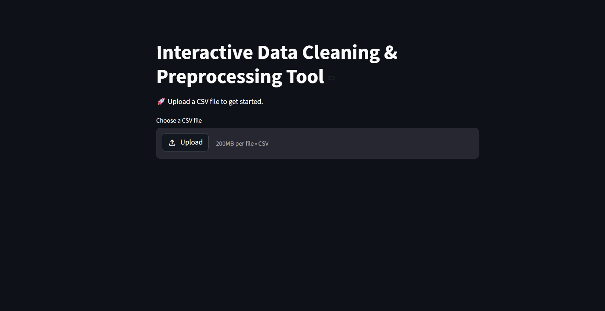
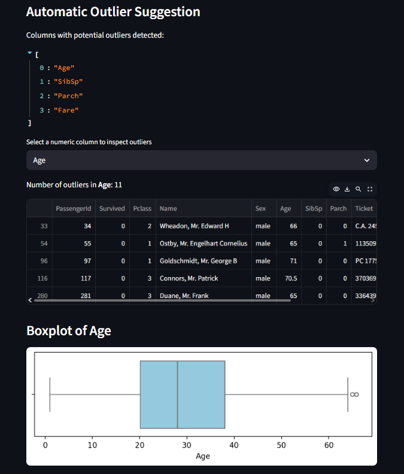
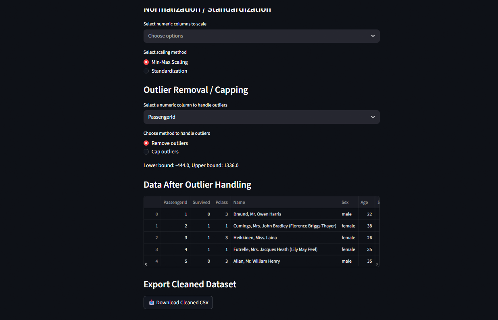

# Interactive Data Cleaning & Preprocessing Tool

An interactive web application built using Python and Streamlit for performing common data cleaning and preprocessing tasks on CSV datasets.

---

## Live Demo

[Open Streamlit App](https://interactive-dct-tool-46350.streamlit.app)

> Note: The Streamlit app may take a few seconds to load initially if it has been inactive.
---

## Features

- Upload CSV datasets
- Handle missing values
  - Drop rows
  - Fill with Mean
  - Fill with Median
  - Fill with Mode
- Automatic outlier detection using IQR
- Boxplot visualization for outlier inspection
- Categorical encoding
  - Label Encoding
  - One-Hot Encoding
- Feature scaling
  - Min-Max Scaling
  - Standardization
- Outlier handling
  - Remove outliers
  - Cap outliers
- Download cleaned dataset as CSV

---

## Screenshots

### Homepage


### Dataset Uploaded


### Working Example 1


### Working Example 2


---

## Sample Dataset

Download a sample CSV for testing the application:

[Download Sample Dataset](sample_data/Titanic-Dataset.csv)

---

## Technologies Used

- Python
- Streamlit
- Pandas
- Matplotlib
- Seaborn
- Scikit-learn

---

## Installation

Clone the repository:

```bash
git clone https://github.com/PrathviRaj60/Interactive-Data-Cleaning-and-Preprocessing-Tool.git
cd Interactive-Data-Cleaning-and-Preprocessing-Tool
```

Create virtual environment:

```bash
python -m venv venv
```

Activate virtual environment (Windows):

```bash
venv\Scripts\activate
```

Install dependencies:

```bash
pip install -r requirements.txt
```

Run the application:

```bash
streamlit run app.py
```

---

## Future Improvements

- Correlation heatmaps
- Automated preprocessing recommendations
- Advanced data profiling
- Model training integration
- Preprocessing reports

---

## Author

Prathviraj